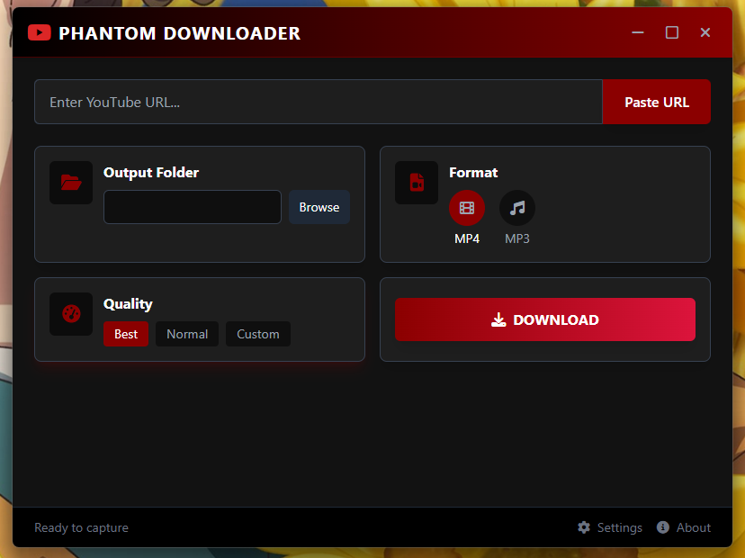

# Phantom Downloader


A stylish, gothic-themed YouTube video and audio downloader built with Tauri and web technologies.

## Features

- Download YouTube videos in MP4 format
- Extract audio as MP3 with customizable quality
- Multiple quality options (Best, Normal, Custom)
- Elegant dark UI with horror/gothic theme
- Progress tracking with speed and ETA
- Download history
- Automatic yt-dlp binary management
- Cross-platform support (Windows, macOS, Linux)

## Screenshots



## Tech Stack

- **Frontend**: HTML, TailwindCSS, JavaScript
- **Backend**: Rust with Tauri
- **Dependencies**: yt-dlp (auto-downloaded)

## How It Works

Phantom Downloader uses the popular yt-dlp command-line tool to handle the actual downloading. The application automatically manages the yt-dlp binary, downloading it if not present, and provides a user-friendly interface to interact with it.

The core functionality includes:
- Automatic detection of existing yt-dlp installations
- Downloading and installing yt-dlp if not found
- Managing download progress with real-time updates
- Format selection (video/audio)
- Quality configuration
- Custom output directory selection

## Installation

### From Releases

1. Download the latest release for your platform from the [releases page](https://github.com/imtaqin/PHANTOM-DOWNLOADER/releases)
2. Install the application:
   - **Windows**: Run the installer (.exe or .msi)
   - **macOS**: Mount the .dmg and drag to Applications
   - **Linux**: Use the .AppImage, .deb, or .rpm package

### Building from Source

Prerequisites:
- Rust and Cargo
- Node.js and npm
- Tauri CLI

```bash
# Clone the repository
git clone https://github.com/imtaqin/PHANTOM-DOWNLOADER.git
cd PHANTOM-DOWNLOADER

# Install dependencies
npm install

# Build the application
npm run tauri build